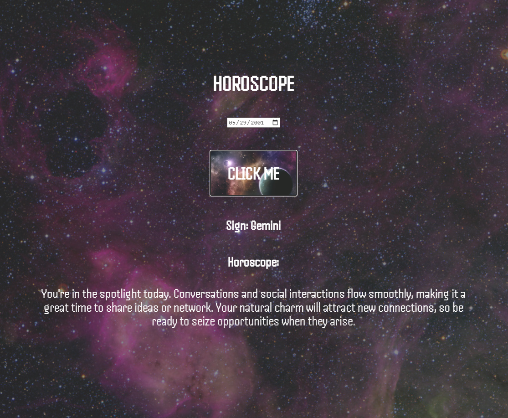

Horoscope App
HTML5, CSS3, Javascript - Simple Horoscope App that displays a horoscope when a user enters their birthday.

 

Link to site: https://simplehoroscopeapp.netlify.app/

How It's Made:

Tech used: HTML5, CSS3, JavaScript

My learning was focused on ensuring that my conditionals were crafted to check specific date ranges to display the appropriate horoscope.

Optimizations

I made sure to account for the unique scenario where a user tried to get their horoscope before entering any date. The app now throws an error if the user clicks the button before choosing a date.

Lessons Learned:

I learned to use the date constructor to display users' birthday in the date format, so that I could use the get UTC month and get UTC date methods to access their corresponding arrays.

